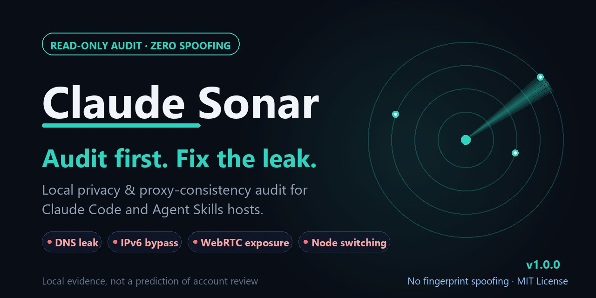

<p align="center">
  
</p>

<h1 align="center">Claude Sonar</h1>

<p align="center"><strong>Local-first privacy and proxy-consistency audit for Claude Code and Agent Skills hosts.</strong></p>

<p align="center">
  
  
  
  
  
  
</p>

<p align="center"><a href="README.zh-CN.md">简体中文</a> · <a href="SKILL.md">Skill instructions</a> · <a href="LICENSE">MIT License</a></p>

> **How is your Claude account doing lately?**
>
> If you use Claude from China, chances are you've seen these before:
>
> - You paid for Pro, and days later the account simply won't sign in
> - Months of conversations and project context, gone overnight with the account
> - Your appeal email vanished into a black hole
> - You registered a fresh account with a new email — banned again before you could really use it
> - You ask perfectly normal questions, yet keep getting flagged as "high risk"
>
> It's probably not bad luck — it's the road your traffic takes. You think everything goes through your proxy, but actually: a DNS lookup quietly asks your home broadband first, a "backup tunnel" connects directly without the proxy, a small WebRTC backdoor lets websites see your real network address, or your proxy node randomly hops between countries at 3am.
>
> **Every one of these leaks tells the platform "something's off."** Accounts get flagged, challenged, even banned — often not because of what you say, but because of these details exposing you. And the worst part: none of it hurts until the ban screen shows up.
>
> Claude Sonar is the tool that checks those details for you — **a read-only checkup that touches nothing**:
>
> - **Traffic routing**: where does your data actually leave from, and is anything slipping past the proxy?
> - **Domain lookups**: when you type a URL, does the query secretly take a detour it shouldn't?
> - **Proxy setup**: are your nodes auto-switching countries, and are your routing rules still working?
> - **System state**: do your timezone, language, and privacy toggles fight each other?
>
> When the checkup finishes, you get a **clear report** — every item labeled: **Must fix** (a real problem), **Optional consistency** (not a risk, but worth aligning), **Leave alone** (don't touch it). At the top sits your **configuration self-consistency score** (simply put: do your settings contradict each other), at a glance.
>
> Then the decision is **entirely yours** — nothing changes without your explicit approval.
>
> And here's what this tool **won't do**:
>
> - It won't help you **impersonate someone else** (no fingerprint spoofing, no hiding automation)
> - It won't help you **fabricate identity** (no fake addresses, billing, or personal info)
> - It will never **guarantee** "this config means you'll never get banned" — anyone who promises that is lying to you.
>
> The "anti-ban" tools teach you to fool the platform. Claude Sonar does one thing: **show you the truth**, and give you back the choice.
>
> **Audit first. Decide after.** Your account deserves one honest check.

## Try it in your browser

No install, no backend: open [`static/demo.html`](static/demo.html) (or visit the hosted copy after the repo is public) for a browser observation — WebRTC ICE candidates, timezone/language, a read-only canvas hash, and your egress IP with third-party labels. Observation only; it never changes system settings and never spoofs a fingerprint. The deep local audit (proxy/DNS/TUN/privacy settings) still requires the installed tool below.

## Install

```bash
pip install -U claude-sonar
```

All features are available since **1.0.0** (renamed from `claude-shield`; older `anti-claude-check` uploads are retired).

## Windows portable build

The repository also ships a one-file local launcher. Build it on Windows with Python and PyInstaller:

```powershell
python -m pip install pyinstaller
python scripts/build_portable_windows.py
```

This produces `dist\\ClaudeSonar.exe` (about 10 MB on the current build). Double-clicking it opens the local panel on a random `127.0.0.1` port; the panel performs the audit locally. It contains no model, browser, or 8 GB data. Online checks are small opt-in HTTP/TCP observations controlled by the panel switch; they do not download a model or dataset. The audit does not modify system settings; the explicit badge action writes `sonar-badge.json` when requested. Keep the console window open while the panel is in use, and press `Ctrl+C` there to stop it. Windows may show an unsigned-app warning because this local build is not code-signed.

As an agent skill (Codex / Claude Code):

```powershell
git clone https://github.com/AschoofAlpha/claude-sonar.git "$HOME/.codex/skills/claude-sonar"
```

Invoke `$claude-sonar` in Codex. For Claude Code, install the same folder as `~/.claude/skills/claude-sonar` and invoke `/claude-sonar`.

## CLI

```bash
python -m claude_sonar                 # markdown report (offline; three groups: Must fix / Optional / Leave alone)
python -m claude_sonar --full          # add the All-results master table
python -m claude_sonar --compact       # shorter markdown (score + must-fix / optional)
python -m claude_sonar --json          # report_dict + summary as JSON
python -m claude_sonar --out report.md
python -m claude_sonar --json --out report.json
python -m claude_sonar --diff previous.json
python -m claude_sonar --online --timeout 5
python -m claude_sonar --online --intended-region US
python -m claude_sonar --intended-mode system_proxy   # or full_tunnel
python -m claude_sonar --lang en
python -m claude_sonar serve --port 8765  # read-only local web panel on 127.0.0.1
python -m claude_sonar serve --open --online --open-delay 8  # Skill flow: chat table + auto-open panel
python -m claude_sonar repo ./my-project  # code security scan (SAST/secrets/deps)
python -m claude_sonar badge              # write sonar-badge.json from an audit
```

Sub-commands (same `python -m claude_sonar` entry point):

- **`serve [--port N] [--open] [--online]`** — zero-dependency local web panel bound to **127.0.0.1 only**. The Skill/portable launch passes `--online`, so the panel's first audit includes approved read-only online probes; normal library calls and CLI audits remain offline by default. `/` renders the audit (score, Must fix / Optional / Leave alone groups, six-dimension matrix, status cards, and expandable evidence). Its Pulse-style directory opens My IP, IPv6, fingerprint, leak, Cloudflare, routing, speed, headers, IP information, and TikTok environment modules; `/api/headers` is a fixed local-header allowlist and `/api/speedtest?mode=latency|download|upload` uses only a bounded Cloudflare endpoint. `/api/report?online=0` explicitly returns the offline redacted report JSON, and the panel switch can turn online probes off and rerun. It also includes browser-side observation (WebRTC ICE candidates, local timezone/language). No system-setting mutations: POST is 405, path traversal is 404, and only loopback `Host` headers are accepted. The explicit `/api/badge` action writes `sonar-badge.json`.
- The panel and `--json` output include a six-dimension status matrix. It reuses existing checks for exit network, leak detection, regional consistency, browser identity, device fingerprint, and platform reachability; it is not an IP-purity, anonymity, or anti-ban score.
- **`repo PATH [--no-tools] [--baseline F] [--json] [--sarif F] [--out F]`** — repository security scan: stack detection, semgrep / gitleaks / pip-audit / npm audit / freshness (npm outdated, pip list --outdated) orchestration with graceful degradation (missing tools are skipped and noted), bundled trimmed Semgrep rules (MIT source noted), weighted 0–100 code-security score, fix suggestions, baseline diff, SARIF 2.1.0 export. No pentesting, no GitHub-issue filing.
- **`badge [--out PATH] [--from-report F]`** — writes `sonar-badge.json` (score + color) for the shields.io dynamic badge below; `--from-report` reuses a previous `--json` report instead of re-auditing.

Online probes (egress, DNS observation, IP reputation, cross-site exits, **DNS-vs-HTTP exit consistency**, **JA3/JA4 TLS fingerprint**) stay **off** unless you pass `--online`. With `--online`, independent probes run in parallel (shared timeout). The `ANTHROPIC_BASE_URL` audit (official endpoint vs a bundled public risk-intel blacklist) always runs offline.

`--out` writes the report to a file **and** still prints to stdout. `--diff` accepts a previous CLI `--json` payload or bare `report_dict` and appends a status-diff section (or a `diff` key in JSON mode). Default markdown is full; pass `--compact` for a short report (`--full` forces full if both are set).

Library defaults: `run_full_audit(include_recommendations=True)` returns `report_markdown` via `format_report`. Windows collector also reports Firefox WebRTC policy presence when detectable.

## What you get

| Layer | Checks |
| --- | --- |
| Claude privacy | 3 main opt-out switches + 6 supplemental vars + local artifact presence |
| Proxy | system proxy / WinHTTP / env vars / PAC / other-client conflicts |
| DNS | fake-IP, port-53 hijack, DoH, physical-resolver residue, browser Secure DNS |
| Routing | TUN, default route, Teredo, IPv6 bypass |
| Consistency | timezone × locale × (online) exit region |
| Personalized | detects your proxy client (Clash Verge / v2rayN / sing-box / …) and gives per-app manual steps |
| Online (opt-in) | DNS-vs-HTTP exit consistency (DoH), JA3/JA4 TLS client fingerprint (openssl capture), AI platform connectivity (ChatGPT/Claude/Grok/Perplexity/Gemini/DeepSeek/通义千问/Kimi, reachability only) |
| Always-on | `ANTHROPIC_BASE_URL` audit vs a bundled public relay-risk blacklist |
| Local panel | `serve` — 127.0.0.1 read-only panel + browser-side WebRTC/timezone observation + Pulse-style modules for egress, IPv6, fingerprint, leak, Cloudflare, routing, speed, headers, IP info, and TikTok environment |
| Repo scan | `repo` — SAST / secrets / dependency audit with a 0–100 code-security score |
| Badge | `badge` — `sonar-badge.json` driving a shields.io dynamic badge |

Results split into **Must fix**, **Optional consistency**, and **Leave alone**; every check carries a plain-language **说明/meaning** column and the report ends with a **configuration self-consistency** score (not anti-ban) plus a footer of what stays **recommend-only never auto** (fingerprint, timezone-follow-node, env wipe, anti-ban score disguise, DNS/route/TUN).

Optional, reversible privacy environment-variable remediation only. No automatic DNS, route, firewall, VPN, or IPv6-adapter changes. Device-ID/cache/fingerprint items appear only as optional recommendations with explicit limits (local hygiene only; not server unban; no anti-detect stacks).

The audit is local evidence, not a prediction of account approval or suspension.

Run `python -m claude_sonar` for a live markdown report (`format_report`: evidence table + Must fix / Optional consistency / Leave alone). No staged demo screenshot is shipped.

## Non-mutating collection

Windows PowerShell 7:

```powershell
pwsh -NoProfile -ExecutionPolicy Bypass -File .\scripts\collect_windows_network.ps1
```

Windows PowerShell 5.1:

```powershell
powershell.exe -NoProfile -ExecutionPolicy Bypass -File .\scripts\collect_windows_network.ps1
```

macOS or Linux:

```bash
python ./scripts/collect_posix_network.py
```

Collector output can contain local identifiers. Keep raw output local and let the Skill redact it before sharing.

## Report

The Skill returns a compact evidence table (`signal`, `status`, `confidence`, `evidence`, `action`) and then automatically starts the local panel; the chat table and the panel are two deliverables from the same audit, with the panel opening after about 8 seconds. See `SKILL.md` for the exact report format and interpretation rules.

## Manual network alternatives (recommend-only)

When the audit flags DNS/HTTP egress divergence, two standard-tool fixes are worth knowing — both manual, reversible, and never applied for you:

- **socks5h remote DNS** — point Claude Code at a `socks5h://127.0.0.1:<port>` proxy URL instead of `socks5://` or `http://`. The `h` moves domain resolution to the proxy end and removes most local-DNS bypass paths.
- **SSH dynamic forwarding** — run `ssh -N -D 1080 user@your-vps` in a terminal you keep open (Windows ships OpenSSH), then point the tool at `socks5h://127.0.0.1:1080` for a fixed, self-owned VPS exit with no local client.

These are ordinary proxy techniques, not spoofing; the audit stays read-only and only ever *suggests* them.

## Privacy opt-outs

Preview first:

```powershell
pwsh -NoProfile -File .\scripts\remediate_windows_network.ps1
```

After explicit approval, apply the documented Claude Code privacy environment variables:

```powershell
pwsh -NoProfile -File .\scripts\remediate_windows_network.ps1 -Apply
```

The script writes a backup and prints the exact rollback command. The broad non-essential-traffic opt-out can disable optional Claude Code features, so enable it only when that tradeoff is intended. On POSIX, `--apply` creates a private environment file and prints the `source` command; it does not edit shell profiles or network settings.

## Safety boundary

- No fingerprint spoofing, automation concealment, CAPTCHA bypass, or multi-account tooling.
- No fabricated identity, residence, billing, tax, or payment information.
- May recommend optional local device-id/cache hygiene or browser WebRTC hardening when artifacts are present; does not auto-delete IDs, does not spoof fingerprints, and cannot clear server-side marks or unban accounts.
- No claim that a configuration prevents account review or suspension.

Use current primary documentation for Claude Code privacy controls and rate limits. Treat third-party detector labels as opinions until live routing evidence corroborates them.

If this project finds a real leak or prevents an unnecessary destructive change, a GitHub star helps others discover it.
